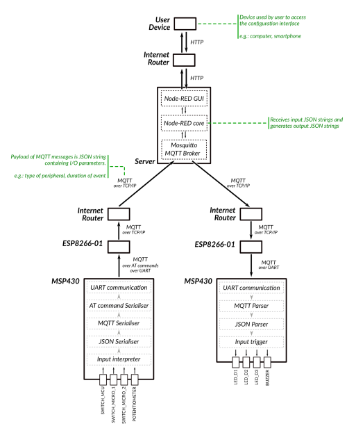

# MSPnet

This project consists in the implementation of an **"if this, then that"** functionality. Devices based on a MSP430 microcontroller are able to send inputs and receive outputs to any similar device connected to the system through Internet. The logic defining the inputs and outputs is based on a web-based server and configurable by the user. For example, blinking a LED on a device for 10 seconds when a switch is toggled on another device.

## Hardware

The devices are based on a MSP430G2553 Launchpad from Texas Instruments embedding a MSP430 microcontroller, and an ESP-01 Wi-Fi module. They are connected via UART.

## User interface

## Building

1. Open the project in '/msp' using IAR EW for MSP430
2. Modify the config.h with the desired configuration for the device targetted.
3. Build the project and download the generated file on the board.
4. Connect to the user interface of the server at http://3.8.210.204:1880/ui to define the logic of inputs and outputs between your boards newly connected.
5. All done! Your system is up and running, you can communicate between boards following your own rules. 

## Tree view

* `/documents` : the documents used for the project management
* `/msp` : the IAR project containing the header and source files relating to the client part of the system, i. e. the device based on a MSP430
* `/server` : the source files related to the server part of the system
* `config.h` : configuration file related to the client comprising parameters such as the WiFi Configuration, the MQTT Broker address or the board setup.

## Built With

* [IAR EW for MSP430](https://www.iar.com/products/architectures/iar-embedded-workbench-for-msp430/) - The IDE used for developing for the MSP430
* [Node-RED](https://nodered.org/) - Programming tool used for the server
* [Eclipse Mosquitto](https://mosquitto.org/) - MQTT broker used for the server
* [Amazon Web Services](https://aws.amazon.com/) - Cloud service used for having a Virtual Private Server

## Authors

* **Emmanuel Durel** 
* **Rémi Fargeon**
* **Titouan Gaborit**
* **Baptiste Méhat**
